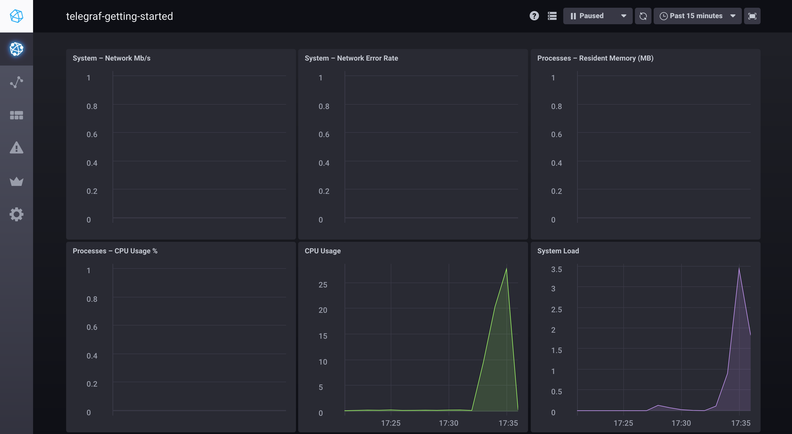

国内访问github太慢，已经迁移至： https://gitee.com/choelea/tick-box

完全参考https://github.com/influxdata/sandbox；使用快捷方式协同运行实现容器监控。
clone后运行 `./tickbox up` 通过http://ip:8888 访问Chronograf进行配置。 其他宿主机的容器的监控，可以拉取同样版本的telegraf镜像运行，复制telegraf-other目录，（注意需要修改HOSTNAME和influxdb部分信息）。

```
// 复制telegraf-other 到/home/  并已经对相关配置做了对应的修改
docker run -d \
--name telegraf \
-v /home/telegraf-other/:/etc/telegraf/  \
-v /var/run/docker.sock:/var/run/docker.sock  \
docker.io/telegraf:1.13.2
```
# InfluxData tickbox

This repo is a quick way to get the entire TICK Stack spun up and working together. It uses [Docker](https://www.docker.com/) to spin up the full TICK stack in a connected fashion. 

 - Telegraf：采用插件机制实现的数据采集服务，可以采集包含Docker容器在内的多种性能数据

 - InfluxDB：专门负责存储时序数据

 - Chronograf：基于React.js编写的性能数据可视化服务

 - Kapacitor：提供告警触发和处理功能

## 安装docker和docker-compose

以阿里云ECS centos7.7示例：
```
yum -y update
yum install docker
yum install docker-compose
```

### Running

To run the `tickbox`, simply use the convenient cli:

```bash
$ ./tickbox
tickbox commands:
  up           -> spin up the tickbox environment 
  down         -> tear down the tickbox environment
  restart      -> restart the tickbox
  influxdb     -> attach to the influx cli
  flux         -> attach to the flux REPL

  enter (influxdb||kapacitor||chronograf||telegraf) -> enter the specified container
  logs  (influxdb||kapacitor||chronograf||telegraf) -> stream logs for the specified container

  delete-data  -> delete all data created by the TICK Stack
  docker-clean -> stop and remove all running docker containers
  rebuild-docs -> rebuild the documentation container to see updates
```

To get started just run `./tickbox up`. You browser will open two tabs:

- `localhost:8888` - Chronograf's address. You will use this as a management UI for the full stack
- `localhost:3010` - Documentation server. This contains a simple markdown server for tutorials and documentation.


> NOTE: Make sure to stop any existing installations of `influxdb`, `kapacitor` or `chronograf`. If you have them running the tickbox will run into port conflicts and fail to properly start. In this case stop the existing processes and run `./tickbox restart`. Also make sure you are **not** using _Docker Toolbox_.

Once the tickbox launches, you should see your dashboard appear in your browser:


You are ready to get started with the TICK Stack!

Click the Host icon in the left navigation bar to see your host (named `telegraf-getting-started`) and its overall status.


You can click on `system` hyperlink to see a pre-built dashboard visualizing the basic system stats for your
host, then check out the tutorials at `http://localhost:3010/tutorials`.

If you are using the nightly builds and want to get started with Flux, make sure you check out the [Getting Started with Flux](./documentation/static/tutorials/flux-getting-started.md) tutorial.

> Note: see [influx-stress](https://github.com/influxdata/influx-stress) to create data for your tickbox.



